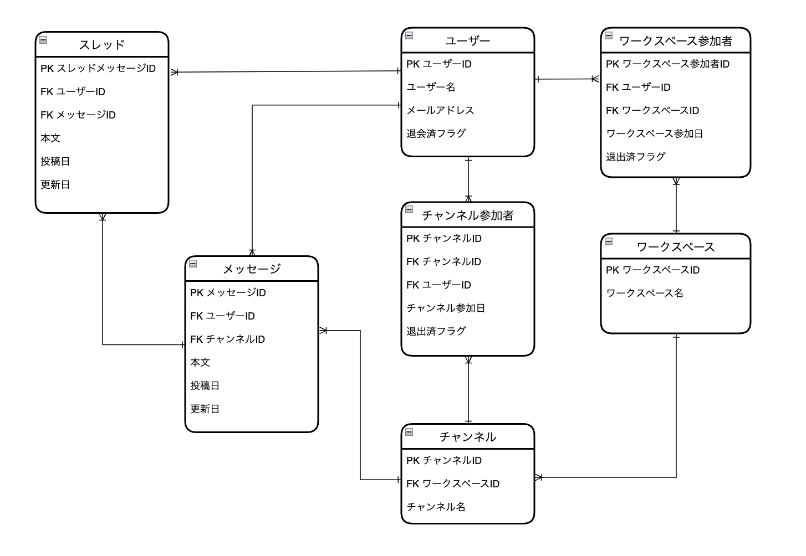

# データモデリング2 課題１

## 要件
Slackのようなチャットサービスのメッセージを保存するためのDBを設計してスケッチを作成してください。

Slackに存在する全ての仕様を満たそうとすると難しすぎるので、以下の仕様を満たすだけで構いません。

- メッセージ
    - 誰が、どのチャネルに、いつ、どんな内容を投稿したのか分かること
- スレッドメッセージ
    - 誰が、どのメッセージに、いつ、どんな内容をスレッドとして投稿したのか分かること
- チャネル
    - そのチャネルに所属しているユーザにしか、メッセージ・スレッドメッセージが見えないこと
- ユーザ
    - ワークスペースに参加・脱退できること
    - チャネルに参加・脱退できること
- 横断機能
    - メッセージとスレッドメッセージを横断的に検索できること（例えば「hoge」と検索したら、この文字列を含むメッセージとスレッドメッセージを両方とも取得できること）
    - 参加していないチャネルのメッセージ・スレッドメッセージは検索できないこと

<aside>
💡 DBモデリングの課題をレビュー依頼する際は、以下4つの成果物が必要です。

- ER図
- 設計したテーブルのDDL
- サンプルデータを投入するDML
- ユースケースを想定したクエリ
</aside>

<br>
<br>

## 実装内容
Slackのようなチャットサービスのメッセージを保存するためのDBを設計してスケッチを作成。



```
- メッセージ
  - 誰が、どのチャネルに、いつ、どんな内容を投稿したのか分かること
```
→ 「メッセージ」 テーブルで管理

<br>
<br>

```
- スレッドメッセージ
  - 誰が、どのメッセージに、いつ、どんな内容をスレッドとして投稿したのか分かること
```
→ 「スレッド」 テーブルで管理

<br>
<br>

```
- ユーザ
  - ワークスペースに参加・脱退できること
  - チャネルに参加・脱退できること
```
→ 「チャンネル参加者」「ワークスペース参加者」 テーブルで管理

<br>
<br>

```
- チャネル
  - そのチャネルに所属しているユーザにしか、メッセージ・スレッドメッセージが見えないこと
- 横断機能
  - メッセージとスレッドメッセージを横断的に検索できること（例えば「hoge」と検索したら、この文字列を含むメッセージとスレッドメッセージを両方とも取得できること）
  - 参加していないチャネルのメッセージ・スレッドメッセージは検索できないこと
```
→ 以下はLaravel(PHP)仕様ですが、バックエンドのロジックも組合せてると以下のような実装で実現できそうと思いました。
```PHP
use Illuminate\Support\Facades\DB;


$user_id = 1; // 仮のユーザID
$channel_id = 10; // 仮のチャンネルID
$search_keyword = 'hoge'; // 検索キーワード

// ユーザーがチャネルに参加しているか確認
$isParticipant = DB::select('SELECT 1 FROM ChannelParticipants WHERE UserID = :userId AND ChannelID = :channelId LIMIT 1', ['userId' => $user_id, 'channelId' => $channel_id]);

if (empty($isParticipant)) {
    // ユーザーがチャンネルに参加していない場合はエラーレスポンスを返す
    return response()->json(['error' => 'User is not a participant of the channel'], 403);
}

// ユーザが参加しているチャンネルのメッセージを検索
$messagesQuery = DB::table('Messages as m')
    ->join('ChannelParticipants as cp', 'm.ChannelID', '=', 'cp.ChannelID')
    ->where('cp.UserID', '=', $user_id) // ユーザーIDをクエリに組込む
    ->where('cp.ChannelID', '=', $channel_id) // チャンネルIDをクエリに組込む
    ->where('m.Content', 'LIKE', '%' . $search_keyword . '%')　// 検索ワードをクエリに組込む
    ->select('m.Content', 'm.PostedDate', DB::raw("'message' as type"));

// ユーザが参加しているチャンネルのスレッドメッセージを検索
$threadsQuery = DB::table('Threads as t')
    ->join('Messages as m', 't.MessageID', '=', 'm.MessageID')
    ->join('ChannelParticipants as cp', 'm.ChannelID', '=', 'cp.ChannelID')
    ->where('cp.UserID', '=', $user_id)　// ユーザーIDをクエリに組込む
    ->where('cp.ChannelID', '=', $channel_id) // チャンネルIDをクエリに組込む
    ->where('t.Content', 'LIKE', '%' . $search_keyword . '%') // 検索ワードをクエリに組込む
    ->select('t.Content', 't.PostedDate', DB::raw("'thread' as type"));

// 2つのクエリを結合して結果を取得
$results = $messagesQuery->unionAll($threadsQuery)->get();

// 結果を表示（これはフロント側で表示すると想定）
foreach ($results as $result) {
    echo "Type: {$result->type}, Content: {$result->Content}, PostedDate: {$result->PostedDate}\n";
}


```

<br>
<br>

## DDL
```SQL
-- Users Table
CREATE TABLE Users (
  UserID INT PRIMARY KEY COMMENT 'ユーザーID',
  UserName VARCHAR(255) COMMENT 'ユーザー名',
  Email VARCHAR(255) COMMENT 'メールアドレス'
) COMMENT 'ユーザーテーブル';

-- WorkSpaces Table
CREATE TABLE WorkSpaces (
  WorkSpaceID INT PRIMARY KEY COMMENT 'ワークスペースID',
  WorkSpaceName VARCHAR(255) COMMENT 'ワークスペース名'
) COMMENT 'ワークスペーステーブル';

-- Channels Table
CREATE TABLE Channels (
  ChannelID INT PRIMARY KEY COMMENT 'カテゴリID',
  WorkSpaceID INT COMMENT 'ワークスペースID',
  ChannelName VARCHAR(255) COMMENT 'チャンネル名',
  FOREIGN KEY (WorkSpaceID) REFERENCES WorkSpaces(WorkSpaceID)
) COMMENT 'チャンネルテーブル';

-- WorkSpaceParticipants Table
CREATE TABLE WorkSpaceParticipants (
  WorkSpaceParticipantID INT PRIMARY KEY COMMENT 'ワークスペース参加者ID',
  UserID INT COMMENT 'ユーザーID',
  WorkSpaceID INT COMMENT 'ワークスペースID',
  FOREIGN KEY (UserID) REFERENCES Users(UserID),
  FOREIGN KEY (WorkSpaceID) REFERENCES WorkSpaces(WorkSpaceID)
) COMMENT 'ワークスペース参加者テーブル';

-- ChannelParticipants Table
CREATE TABLE ChannelParticipants (
  ChannelParticipantID INT PRIMARY KEY COMMENT 'チャンネル参加者ID',
  UserID INT COMMENT 'ユーザーID',
  ChannelID INT COMMENT 'チャンネルID',
  FOREIGN KEY (UserID) REFERENCES Users(UserID),
  FOREIGN KEY (ChannelID) REFERENCES Channels(ChannelID)
) COMMENT 'チャンネル参加者テーブル';

-- Messages Table
CREATE TABLE Messages (
  MessageID INT PRIMARY KEY COMMENT 'メッセージID',
  UserID INT COMMENT 'ユーザーID',
  ChannelID INT COMMENT 'チャンネルID',
  Content VARCHAR(255) COMMENT '本文',
  PostedDate DateTime COMMENT '投稿日',
  FOREIGN KEY (UserID) REFERENCES Users(UserID),
  FOREIGN KEY (ChannelID) REFERENCES Channels(ChannelID)
) COMMENT 'メッセージテーブル';

-- Threads Table
CREATE TABLE Threads (
  ThreadID INT PRIMARY KEY COMMENT 'スレッドID',
  UserID INT COMMENT 'ユーザーID',
  MessageID INT COMMENT 'メッセージID',
  Content VARCHAR(255) COMMENT '本文',
  PostedDate DateTime COMMENT '投稿日',
  FOREIGN KEY (UserID) REFERENCES Users(UserID),
  FOREIGN KEY (MessageID) REFERENCES Messages(MessageID)
) COMMENT 'スレッドテーブル';

```

<br>
<br>

### DML
```SQL
-- Usersテーブルへのデータ挿入
INSERT INTO Users (UserID, UserName, Email) VALUES
(1, 'ユーザーA', 'usera@example.com'),
(2, 'ユーザーB', 'userb@example.com'),
(3, 'ユーザーC', 'userc@example.com');

-- WorkSpacesテーブルへのデータ挿入
INSERT INTO WorkSpaces (WorkSpaceID, WorkSpaceName) VALUES
(1, 'ワークスペース1'),
(2, 'ワークスペース2');

-- Channelsテーブルへのデータ挿入
INSERT INTO Channels (ChannelID, WorkSpaceID, ChannelName) VALUES
(1, 1, 'チャンネル1'),
(2, 1, 'チャンネル2'),
(3, 2, 'チャンネル3');

-- WorkSpaceParticipantsテーブルへのデータ挿入
INSERT INTO WorkSpaceParticipants (WorkSpaceParticipantID, UserID, WorkSpaceID) VALUES
(1, 1, 1),
(2, 2, 1),
(3, 3, 2);

-- ChannelParticipantsテーブルへのデータ挿入
INSERT INTO ChannelParticipants (ChannelParticipantID, UserID, ChannelID) VALUES
(1, 1, 1),
(2, 2, 2),
(3, 3, 3);

-- Messagesテーブルへのデータ挿入
INSERT INTO Messages (MessageID, UserID, ChannelID, Content, PostedDate) VALUES
(1, 1, 1, 'こんにちは、チャンネル1です。', '2024-01-01 12:00:00'),
(2, 2, 2, 'こんにちは、チャンネル2です。', '2024-01-02 13:00:00');

-- Threadsテーブルへのデータ挿入
INSERT INTO Threads (ThreadID, UserID, MessageID, Content, PostedDate) VALUES
(1, 2, 1, 'チャンネル1への返信です。', '2024-01-01 12:30:00');

```

<br>
<br>

## ユースケースを想定したクエリ
```SQL
-- 特定のワークスペースに参加している全ユーザーをリストする
SELECT u.UserID, u.UserName, u.Email
FROM Users u
JOIN WorkSpaceParticipants wsp ON u.UserID = wsp.UserID
WHERE wsp.WorkSpaceID = 1;

-- 特定のチャンネルにおける全メッセージを時系列順に取得する
SELECT m.Content, m.PostedDate, u.UserName
FROM Messages m
JOIN Users u ON m.UserID = u.UserID
WHERE m.ChannelID = 1
ORDER BY m.PostedDate ASC;

-- メッセージに対する全スレッドを時系列順に取得する
SELECT t.Content, t.PostedDate, u.UserName
FROM Threads t
JOIN Messages m ON t.MessageID = m.MessageID
JOIN Users u ON t.UserID = u.UserID
WHERE t.MessageID = 1
ORDER BY t.PostedDate ASC;

```
